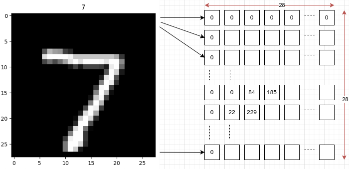
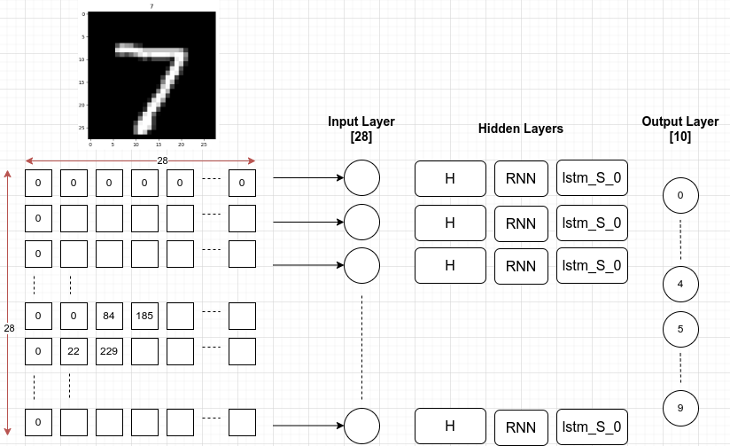
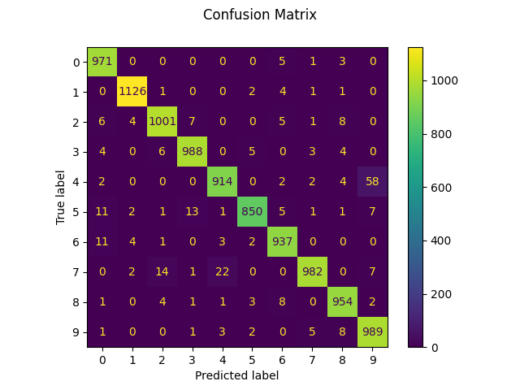

# Handwritten Digits Classification using RNN with the implementation in Pytorch

This example is documented and referred to the source as follows.
   + https://medium.com/@nutanbhogendrasharma/pytorch-recurrent-neural-networks-with-mnist-dataset-2195033b540f
   + https://github.com/MorvanZhou/PyTorch-Tutorial/blob/master/tutorial-contents/402_RNN_classifier.py

## Overview
Build a simple Recurrent neural network in PyTorch and train it to classify (recognize) handwritten digits using the MNIST dataset

## MNIST dataset
* A database of handwritten digits from 0 to 9
* Containing 60,000 training images and 10,000 testing images.
* The images are grayscale, 28x28 pixels, and centered to reduce preprocessing and get started quicker

An 28x28 image can be represented as an array in the implementation.



## RNN model overview

The model overview is shown in the figure below, where we have the input layer including 28 features. Each feature accounts for a 28-elements row/vector because the figure has the size of 28x28. Hidden layers are RNN units, in particular, we use LSTM units. The output layer contains 10 values accounting for 10 classes of digits, such as number 0, 1, 2, ..., 9.



## Training

The training process is performed with a train dataset, 60000 images. In which, we configure the batch ize is 100 images. The following is the loss values during our training the above model.

``` Python
Epoch [1/2], Step [100/600], Loss: 0.2070
Epoch [1/2], Step [200/600], Loss: 0.2740
Epoch [1/2], Step [300/600], Loss: 0.0656
Epoch [1/2], Step [400/600], Loss: 0.1101
Epoch [1/2], Step [500/600], Loss: 0.2240
Epoch [1/2], Step [600/600], Loss: 0.0836
Epoch [2/2], Step [100/600], Loss: 0.2312
Epoch [2/2], Step [200/600], Loss: 0.1434
Epoch [2/2], Step [300/600], Loss: 0.0887
Epoch [2/2], Step [400/600], Loss: 0.0712
Epoch [2/2], Step [500/600], Loss: 0.0234
Epoch [2/2], Step [600/600], Loss: 0.1583
```

## Evaluation

The performance evaluation is performed with a test dataset, 10000 images, where we set the batch size is also 100 images. The following is the average results about precision, recall, f1-score, and support. These metrics are calculated by using sklearn classification report.

``` Python
         class   precision    recall  f1-score   support

           0       0.99      0.99      0.99       980
           1       0.98      0.99      0.99      1135
           2       0.96      0.99      0.97      1032
           3       0.99      0.98      0.98      1010
           4       0.99      0.94      0.97       982
           5       0.96      0.98      0.97       892
           6       0.99      0.98      0.98       958
           7       0.98      0.97      0.97      1028
           8       0.97      0.97      0.97       974
           9       0.96      0.96      0.96      1009

    accuracy                           0.97     10000
   macro avg       0.97      0.97      0.97     10000
weighted avg       0.97      0.97      0.97     10000
```

Besides that, the confusion matrix of the classification is shown below.



